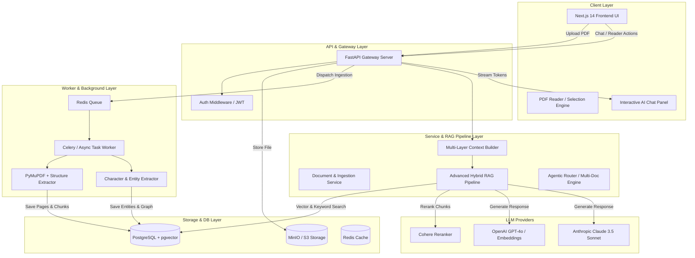

# AI PDF Chatter — System Architecture, Tech Stack & Database Specification

> **Version:** 1.0.0  
> **Target Roadmap:** Phases 0 through 14  
> **Design Philosophy:** Decoupled, modular, extensible architecture ensuring smooth feature additions without breaking schema or requiring refactoring of core modules.

---

## 1. Complete Technology Stack

### Frontend Application
- **Framework:** Next.js 14+ (React 18, App Router, TypeScript)
- **Styling & UI:** Tailwind CSS, Lucide Icons, Shadcn UI primitives, Framer Motion (for fluid micro-animations)
- **State Management:** Zustand (Global reader state, active selection, UI toggles), TanStack React Query v5 (Async server state & caching)
- **PDF Rendering & Interaction:** PDF.js / `@react-pdf-viewer/core` with custom selection hook layer
- **Real-Time / Streaming:** Server-Sent Events (SSE) / WebSockets for token streaming AI responses

### Backend API & Processing Pipeline
- **Framework:** Python 3.11+ with **FastAPI** (Async, high-performance, Pydantic v2 validation)
- **ORM & DB Access:** Async SQLAlchemy 2.0 + Alembic (Database migrations)
- **Background Task Workers:** Redis 7 + Celery / ARQ (Asynchronous PDF ingestion, text extraction, chunking, embedding generation, OCR, graph extraction)
- **AI Abstraction Layer:** LiteLLM / LangChain Core / Custom Provider SDK (Seamless swapping between OpenAI GPT-4o, Anthropic Claude 3.5 Sonnet, DeepSeek)
- **Vector Search Engine:** PostgreSQL 16 with `pgvector` extension (HNSW indexing for fast approximate nearest neighbor search)
- **PDF Parsing & NLP Pipeline:**
  - `PyMuPDF` (fitz) + `pdfplumber` (PDF layout & text extraction)
  - `Tesseract OCR` / `pdf2image` (Scanned PDF handling)
  - `spacy` / `nltk` (Structure & Entity Extraction for Phase 10)
  - `sentence-transformers` / `cohere` (Local embedding & Reranking fallback)

### Infrastructure & File Storage
- **Primary Database:** PostgreSQL 16 (Relational + Vector DB in a single instance)
- **Caching & Message Queue:** Redis 7
- **Object / File Storage:** MinIO (Local Dev) / AWS S3 / Cloudflare R2 (Production) for storing raw PDF files and generated assets

---

## 2. Comprehensive Database Schema (PostgreSQL + pgvector)

```sql
-- Enable pgvector extension
CREATE EXTENSION IF NOT EXISTS vector;
CREATE EXTENSION IF NOT EXISTS "uuid-ossp";

-- ---------------------------------------------------------------------
-- 1. USERS & AUTHENTICATION
-- ---------------------------------------------------------------------
CREATE TABLE users (
    id UUID PRIMARY KEY DEFAULT uuid_generate_v4(),
    email VARCHAR(255) UNIQUE NOT NULL,
    password_hash VARCHAR(255) NOT NULL,
    full_name VARCHAR(255),
    created_at TIMESTAMP WITH TIME ZONE DEFAULT CURRENT_TIMESTAMP,
    updated_at TIMESTAMP WITH TIME ZONE DEFAULT CURRENT_TIMESTAMP
);

-- ---------------------------------------------------------------------
-- 2. DOCUMENTS & METADATA
-- ---------------------------------------------------------------------
CREATE TYPE document_status AS ENUM ('PENDING', 'PROCESSING', 'COMPLETED', 'FAILED');

CREATE TABLE documents (
    id UUID PRIMARY KEY DEFAULT uuid_generate_v4(),
    user_id UUID NOT NULL REFERENCES users(id) ON DELETE CASCADE,
    title VARCHAR(512) NOT NULL,
    original_filename VARCHAR(512) NOT NULL,
    storage_key VARCHAR(1024) NOT NULL,
    file_size_bytes BIGINT NOT NULL,
    page_count INT DEFAULT 0,
    processing_status document_status DEFAULT 'PENDING',
    error_message TEXT,
    created_at TIMESTAMP WITH TIME ZONE DEFAULT CURRENT_TIMESTAMP,
    updated_at TIMESTAMP WITH TIME ZONE DEFAULT CURRENT_TIMESTAMP
);

CREATE INDEX idx_documents_user_id ON documents(user_id);

-- ---------------------------------------------------------------------
-- 3. DOCUMENT PAGES (Page-aware structure for citations & context)
-- ---------------------------------------------------------------------
CREATE TABLE document_pages (
    id UUID PRIMARY KEY DEFAULT uuid_generate_v4(),
    document_id UUID NOT NULL REFERENCES documents(id) ON DELETE CASCADE,
    page_number INT NOT NULL,
    raw_text TEXT NOT NULL,
    page_width FLOAT,
    page_height FLOAT,
    created_at TIMESTAMP WITH TIME ZONE DEFAULT CURRENT_TIMESTAMP,
    UNIQUE(document_id, page_number)
);

CREATE INDEX idx_document_pages_doc_page ON document_pages(document_id, page_number);

-- ---------------------------------------------------------------------
-- 4. DOCUMENT CHUNKS & VECTOR EMBEDDINGS (Phase 2 & 8)
-- ---------------------------------------------------------------------
CREATE TABLE document_chunks (
    id UUID PRIMARY KEY DEFAULT uuid_generate_v4(),
    document_id UUID NOT NULL REFERENCES documents(id) ON DELETE CASCADE,
    page_start INT NOT NULL,
    page_end INT NOT NULL,
    chapter_title VARCHAR(255),
    section_title VARCHAR(255),
    content TEXT NOT NULL,
    token_count INT NOT NULL,
    embedding vector(1536), -- Dimension for text-embedding-3-small
    metadata_json JSONB DEFAULT '{}'::jsonb,
    created_at TIMESTAMP WITH TIME ZONE DEFAULT CURRENT_TIMESTAMP
);

-- HNSW Vector index for fast similarity search
CREATE INDEX idx_document_chunks_embedding ON document_chunks 
USING hnsw (embedding vector_cosine_ops);

CREATE INDEX idx_document_chunks_doc_id ON document_chunks(document_id);

-- ---------------------------------------------------------------------
-- 5. READING PROGRESS (Phase 1)
-- ---------------------------------------------------------------------
CREATE TABLE reading_progress (
    id UUID PRIMARY KEY DEFAULT uuid_generate_v4(),
    user_id UUID NOT NULL REFERENCES users(id) ON DELETE CASCADE,
    document_id UUID NOT NULL REFERENCES documents(id) ON DELETE CASCADE,
    current_page INT NOT NULL DEFAULT 1,
    scroll_position_pct FLOAT DEFAULT 0.0,
    last_opened_at TIMESTAMP WITH TIME ZONE DEFAULT CURRENT_TIMESTAMP,
    UNIQUE(user_id, document_id)
);

-- ---------------------------------------------------------------------
-- 6. CONVERSATIONS & CHAT MESSAGES (Phases 3, 4 & 5)
-- ---------------------------------------------------------------------
CREATE TYPE chat_mode AS ENUM ('RAG_CHAT', 'CONTEXT_READING', 'TUTOR', 'CHARACTER_INTEL');

CREATE TABLE conversations (
    id UUID PRIMARY KEY DEFAULT uuid_generate_v4(),
    user_id UUID NOT NULL REFERENCES users(id) ON DELETE CASCADE,
    document_id UUID NOT NULL REFERENCES documents(id) ON DELETE CASCADE,
    title VARCHAR(255) NOT NULL,
    mode chat_mode DEFAULT 'RAG_CHAT',
    created_at TIMESTAMP WITH TIME ZONE DEFAULT CURRENT_TIMESTAMP,
    updated_at TIMESTAMP WITH TIME ZONE DEFAULT CURRENT_TIMESTAMP
);

CREATE TABLE chat_messages (
    id UUID PRIMARY KEY DEFAULT uuid_generate_v4(),
    conversation_id UUID NOT NULL REFERENCES conversations(id) ON DELETE CASCADE,
    sender VARCHAR(20) NOT NULL CHECK (sender IN ('USER', 'AI', 'SYSTEM')),
    content TEXT NOT NULL,
    -- Context snapshot captured when message was sent (Selection, Page, Chapter)
    context_snapshot JSONB DEFAULT '{}'::jsonb,
    -- Citations returned by AI (Page numbers, text snippets, chunk_ids)
    citations JSONB DEFAULT '[]'::jsonb,
    token_usage JSONB DEFAULT '{}'::jsonb,
    created_at TIMESTAMP WITH TIME ZONE DEFAULT CURRENT_TIMESTAMP
);

CREATE INDEX idx_chat_messages_conv_id ON chat_messages(conversation_id);

-- ---------------------------------------------------------------------
-- 7. HIGHLIGHTS & ANNOTATIONS (Phase 6)
-- ---------------------------------------------------------------------
CREATE TABLE highlights (
    id UUID PRIMARY KEY DEFAULT uuid_generate_v4(),
    user_id UUID NOT NULL REFERENCES users(id) ON DELETE CASCADE,
    document_id UUID NOT NULL REFERENCES documents(id) ON DELETE CASCADE,
    page_number INT NOT NULL,
    selected_text TEXT NOT NULL,
    start_offset INT NOT NULL,
    end_offset INT NOT NULL,
    color VARCHAR(30) DEFAULT 'yellow',
    note_text TEXT,
    created_at TIMESTAMP WITH TIME ZONE DEFAULT CURRENT_TIMESTAMP,
    updated_at TIMESTAMP WITH TIME ZONE DEFAULT CURRENT_TIMESTAMP
);

CREATE INDEX idx_highlights_doc_user ON highlights(document_id, user_id);

-- ---------------------------------------------------------------------
-- 8. ENTITIES & RELATIONSHIPS GRAPH (Phase 10 - Novel / Character Intel)
-- ---------------------------------------------------------------------
CREATE TABLE entities (
    id UUID PRIMARY KEY DEFAULT uuid_generate_v4(),
    document_id UUID NOT NULL REFERENCES documents(id) ON DELETE CASCADE,
    name VARCHAR(255) NOT NULL,
    entity_type VARCHAR(50) NOT NULL, -- e.g., 'CHARACTER', 'LOCATION', 'ORGANIZATION', 'EVENT'
    description TEXT,
    first_appeared_page INT,
    attributes JSONB DEFAULT '{}'::jsonb,
    created_at TIMESTAMP WITH TIME ZONE DEFAULT CURRENT_TIMESTAMP
);

CREATE TABLE entity_relationships (
    id UUID PRIMARY KEY DEFAULT uuid_generate_v4(),
    document_id UUID NOT NULL REFERENCES documents(id) ON DELETE CASCADE,
    source_entity_id UUID NOT NULL REFERENCES entities(id) ON DELETE CASCADE,
    target_entity_id UUID NOT NULL REFERENCES entities(id) ON DELETE CASCADE,
    relationship_type VARCHAR(100) NOT NULL, -- e.g., 'ALLIED_WITH', 'DISTRUSTS', 'BROTHER_OF'
    description TEXT,
    evidence_chunk_id UUID REFERENCES document_chunks(id) ON DELETE SET NULL,
    created_at TIMESTAMP WITH TIME ZONE DEFAULT CURRENT_TIMESTAMP
);

-- ---------------------------------------------------------------------
-- 9. EVALUATION & QUALITY BENCHMARKS (Phase 13)
-- ---------------------------------------------------------------------
CREATE TABLE eval_runs (
    id UUID PRIMARY KEY DEFAULT uuid_generate_v4(),
    run_name VARCHAR(255) NOT NULL,
    pipeline_config JSONB NOT NULL,
    recall_score FLOAT,
    precision_score FLOAT,
    faithfulness_score FLOAT,
    avg_latency_ms FLOAT,
    total_cost_usd FLOAT,
    created_at TIMESTAMP WITH TIME ZONE DEFAULT CURRENT_TIMESTAMP
);
```

---

## 3. High-Level Service Architecture & Data Flow



---

## 4. Repository & Project Directory Structure

```text
ai-pdfchatter/
├── docker-compose.yml
├── README.md
├── ARCHITECTURE_SPEC.md
│
├── frontend/                     # Next.js 14 Frontend Application
│   ├── package.json
│   ├── next.config.js
│   ├── tailwind.config.js
│   ├── public/
│   └── src/
│       ├── app/                  # App Router Routes
│       │   ├── (auth)/
│       │   │   ├── login/
│       │   │   └── signup/
│       │   ├── dashboard/        # PDF Library (Phase 1)
│       │   ├── reader/[id]/      # PDF Reader + AI Workspace (Phases 1-12)
│       │   └── api/              # Local Next API proxy/routes
│       ├── components/
│       │   ├── ui/               # Base design system components
│       │   ├── reader/           # PDF Viewer, toolbar, highlight overlay
│       │   ├── chat/             # AI chat panel, citations, context badges
│       │   ├── notes/            # Highlights & notes list
│       │   └── tutor/            # AI Study / Teach Me mode components
│       ├── hooks/                # Custom React hooks (usePdfSelection, useChatStream)
│       ├── lib/                  # API client, PDF.js setup, utilities
│       ├── store/                # Zustand state stores (readerStore, chatStore)
│       └── types/                # Shared TypeScript interfaces
│
└── backend/                      # FastAPI Backend Application
    ├── pyproject.toml / requirements.txt
    ├── Dockerfile
    ├── alembic/                  # Database migration scripts
    └── app/
        ├── main.py               # FastAPI App entrypoint
        ├── core/                 # App config, security, database session
        │   ├── config.py
        │   ├── database.py
        │   └── security.py
        ├── models/               # SQLAlchemy Models
        │   ├── user.py
        │   ├── document.py
        │   ├── chunk.py
        │   ├── conversation.py
        │   └── annotation.py
        ├── schemas/              # Pydantic Schemas
        │   ├── document.py
        │   ├── chat.py
        │   └── annotation.py
        ├── api/                  # REST API Route Endpoints
        │   ├── v1/
        │   │   ├── auth.py
        │   │   ├── documents.py
        │   │   ├── chat.py
        │   │   ├── highlights.py
        │   │   └── tutor.py
        ├── services/             # Domain & AI Services
        │   ├── pdf_processor.py  # PDF text & structure extraction
        │   ├── chunking.py       # Context-aware chunker
        │   ├── embeddings.py     # Embedding generator abstraction
        │   ├── rag_engine.py     # Hybrid search, reranking & synthesis
        │   ├── context_builder.py# Multi-layer context assembler (Phase 4)
        │   ├── entity_graph.py   # Character & Relationship extractor (Phase 10)
        │   └── agent_service.py  # Multi-step agentic analyzer (Phase 11)
        └── workers/              # Celery / ARQ Background Task Workers
            ├── celery_app.py
            └── tasks.py
```

---

## 5. Phase-by-Phase Technical Compatibility Plan

| Phase | Added Component / Feature | Architectural Compatibility Strategy |
| :--- | :--- | :--- |
| **Phase 0** | Infrastructure & Architecture | Fast API + PostgreSQL (pgvector) + Next.js baseline set up with generic abstractions. |
| **Phase 1** | PDF Library & Viewer | `documents` & `reading_progress` DB tables. PDF.js viewer integrated with page tracking hook. |
| **Phase 2** | PDF Processing Pipeline | Async worker extracts PDF layout, populates `document_pages` and `document_chunks` with HNSW vector index. |
| **Phase 3** | Basic RAG Chat | Vector similarity query against `document_chunks` with standard LLM prompt & citation generator. |
| **Phase 4** | Context-Aware Reading | Selection listener in Next.js captures active text, page #, and section. `context_builder.py` fuses 5 context layers. |
| **Phase 5** | Conversation Memory | `conversations` and `chat_messages` tables store context snapshots and multi-turn state. |
| **Phase 6** | Notes & Highlights | `highlights` table created with coordinate offsets; AI queries include user notes for context. |
| **Phase 7** | AI Study & Tutor Mode | Mode flag on conversations; dedicated prompts for progressive learning, quizzes, and summaries. |
| **Phase 8** | Advanced Retrieval | Hybrid search (pgvector + PostgreSQL full-text tsvector) + Cohere reranker in `rag_engine.py`. |
| **Phase 9** | Multi-Modal & Tables | Tesseract OCR + pdf2image pipeline integrated into background workers. |
| **Phase 10**| Character / Novel Intel | Entity & relationship graph tables extracted during ingestion using NLP/Spacy pipelines. |
| **Phase 11**| Agentic PDF Assistant | ReAct / Planning agent orchestration in `agent_service.py` selecting sub-tasks dynamically. |
| **Phase 12**| Multi-Doc Intelligence | Vector search spans multiple `document_id` filter sets in PostgreSQL vector queries. |
| **Phase 13**| Evaluation Engineering | Automated benchmark runner evaluating synthetic QA pairs against `eval_runs`. |
| **Phase 14**| Production & Scaling | Redis caching layer, rate limiting, S3 CDN storage, and load balancing configurations. |
